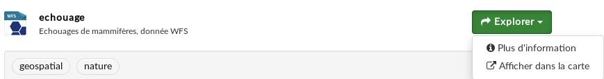
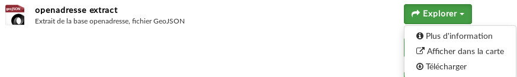

# Visualiser les ressources géospatiales

geOrchestra est une plate-forme pour données géospatiales. Il est donc logique que la visualisation des données 
géospatiales se fasse au sein de la plate-forme, dans le viewer mapfishapp.

Pour l'instant, sont supportés les formats suivants : 
* WMS
* WFS
* GeoJSON

## Service WMS

### Configuration de la ressource
* **URL** : URL du service WMS. Par ex. `https://www.geo2france.fr/geoserver/wms`
* **Nom** : nom de la couche. Par exemple `picardie_nature:tracking`
* **Format** : `WMS`

Vous pouvez aussi passer l'espace de nommage dans l'url, qui devient `https://www.geo2france.fr/geoserver/picardie_nature/wms` et le nom `tracking`

### Visualisation
Cliquer sur 'Afficher dans la carte' : 

## Service WFS

### Configuration de la ressource
* **URL** : URL du service WFS. Par ex. `https://www.geo2france.fr/geoserver/wfs`
* **Nom** : nom de la couche. Par exemple `picardie_nature:echouage`
* **Format** : `WFS`

### Visualisation
Cliquer sur 'Afficher dans la carte' : 

## Fichier GeoJSON

### Configuration de la ressource
* **Fichier** : utiliser le bouton `Envoi` pour uploader le fichier GeoJSON
* **Nom** : nom affiché pour la ressource. Saisie libre
* **Format** : `GeoJSON`

### Visualisation
On peut l'afficher dans la carte. Il sera alors ouvert dans mapfishapp.

Ou bien le télécharger. En fait, il est fort probable que cliquer sur Télécharger l'ouvre dans votre navigateur. Il vous
suffit alors de faire un clic droit et choisir "Enregistrer sous" pour l'enregistrer sur votre ordinateur.

